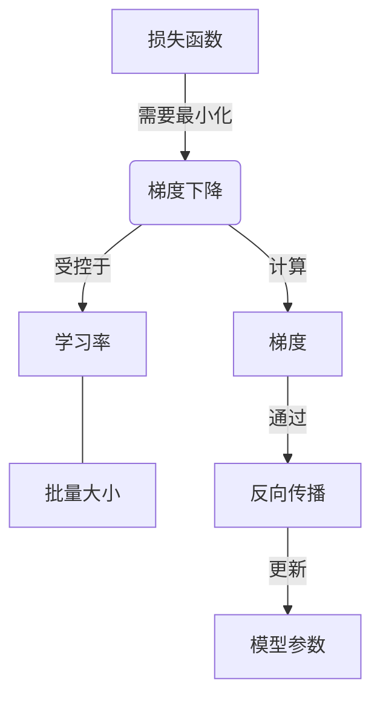

# AcademicNoteAgent — 面向学术写作的自适应笔记智能体

> 将 PDF 讲义、PPT 课件自动整理为结构清晰的学术笔记。支持 **LaTeX**（可编译 PDF）与 **Markdown** 双格式输出。

AcademicNoteAgent 是一个命令行智能体，基于 DeepSeek 大语言模型与 Qwen-VL 多模态视觉模型，具备**自主感知、记忆学习、大纲先行、多轮修订、结构级调整、断点续传**等能力。它不只是"提取文字"，而是根据你选择的**笔记风格**（论述型 / 结构化型 / 极简型 / 自定义），将原始材料重构为真正有用的知识产物。

---

## 🧠 核心特性

| 特性 | 说明 |
|------|------|
| 📝 **笔记风格** | 三种内置风格（论述型 / 结构化型 / 极简型）+ 自定义风格追加，适配不同学习场景 |
| 🕸️ **概念图谱** | 长文档自动生成核心概念关系图（Mermaid 语法），Markdown 直接渲染，LaTeX 输出文字版 + `.mmd` 附件 |
| 📋 **大纲先行** | 长文档先由 AI 生成内容大纲，经确认后再出正文，避免碎片化 |
| 📑 **分段生成** | 超长文档（>3万字）自动切分为多个片段逐段生成，每段保留上下文衔接，引言和总结单独基于全局生成 |
| 🔧 **结构级修订** | 一键修复 5 种结构问题（碎片化、缺关联、比例失衡、冗长、浅显），不用写长篇修改意见 |
| 🖼️ **视觉描述 + OCR** | 百炼 Qwen-VL 识别图表、手写笔迹、扫描件；本地 Tesseract 作为回退 |
| 📦 **自定义模板** | 上传自有 LaTeX 模板到 `Template/custom/`，自动检测并应用 |
| 📑 **批量处理** | 一次处理多个文件，统一配置、分别输出 |
| 🧠 **记忆学习** | `config.json` 记录偏好，越用越懂你 |
| ⏸️ **断点续传** | 随时中断，下次自动从断点继续 |
| 🔍 **原文追溯** | 在关键论点旁标注原始页码 |

---

## 🚀 一分钟速览

```bash
# 1. 把文件放进 Source/
# 2. 运行
python main.py

# 3. 按提示选择：文件 → 风格（论述/结构化/极简）→ OCR模式 → 生成
# 4. 长文档会先展示大纲供确认
# 5. 修订时可选择结构级调整，或输入具体意见
# 6. 输出到 Result/Article_X/
```

---

## 📁 项目结构

```
project/
├── main.py               # 主入口
├── ai_client.py          # DeepSeek API 调用（生成、修正、修订、大纲）
├── text_extractor.py     # PDF/PPTX 文本提取（含视觉描述与 OCR）
├── ui_prompts.py         # 交互式配置
├── config_manager.py     # 配置管理与断点续传
├── template_filler.py    # LaTeX 模板填充与输出管理
├── utils.py              # 工具函数
├── requirements.txt
├── .env.example          # 环境变量模板 ← 复制为 .env 后填写
├── config.json           # 自动生成，记录偏好与反馈
├── session_state.json    # 断点续传用（完成后自动删除）
├── Source/               # 待处理文件
├── Template/             # LaTeX 模板
│   ├── 0_main.tex
│   ├── headerfooter.tex
│   └── custom/           # 用户自定义模板
└── Result/               # 输出目录
    ├── Article_1/
    └── ...
```

---

## 🛠️ 安装与配置

### 环境要求
- Python 3.8+
- 完整 TeX 发行版（仅 LaTeX 输出需要，需支持 XeLaTeX）
- Tesseract OCR & Poppler（可选，仅本地 OCR 回退需要）

### 1. 安装依赖
```bash
git clone <your-repo-url>
cd project
pip install -r requirements.txt
```

### 2. 配置 API 密钥
```bash
cp .env.example .env
```

编辑 `.env`：
```
DEEPSEEK_API_KEY=你的 DeepSeek 密钥
DASHSCOPE_API_KEY=你的百炼 API Key

# 以下可选（Windows 本地 OCR 必需）：
TESSERACT_CMD=C:\Program Files\Tesseract-OCR\tesseract.exe
POPPLER_PATH=C:\poppler\bin
```

- **DeepSeek API Key**：从 [DeepSeek 开放平台](https://platform.deepseek.com/) 获取，负责笔记生成、语法修正、修订。
- **百炼 API Key**：从 [阿里云百炼平台](https://bailian.console.aliyun.com/) 获取，负责视觉描述和 OCR。如果不需要 OCR，可跳过，程序会回退到本地 Tesseract。

### 3. 准备 LaTeX 模板（仅 LaTeX 输出需要）
项目已包含默认模板。如需自定义，将 `0_main_<名称>.tex` 和 `headerfooter_<名称>.tex` 放入 `Template/custom/` 即可。

---

## 📖 使用指南

### 笔记风格怎么选？

| 风格 | 输出形态 | 适合场景 |
|------|----------|----------|
| **论述型**（默认） | 像一篇连贯的学术综述，保留完整论证脉络，有过渡句和关联总结 | 理论性强的课程讲义、学术论文 |
| **结构化型** | 模块化整理，每块含"核心概念→展开→关联"，层次清晰 | 需要系统学习的科目（数学、法律等） |
| **极简型** | 高密度 bullet points，聚焦核心结论 | 考前快速复习、速查手册 |
| **自定义风格** | 在三种内置风格基础上追加你自己的要求（如"每节加表格""突出公式推导"） | 有特定格式偏好或个人学习习惯的场合 |

> 系统会记住你的常用风格，下次提供"快速通道"一键采用。自定义风格保存后也会进入记忆，常用自定义风格会被自动推荐。

### 大纲先行（长文档）

当原文超过 **6000 字符**，程序会自动生成内容大纲并展示：
- **回车** → 确认大纲，继续生成全文
- **输入修改意见** → AI 调整大纲（最多 2 轮）
- **输入 `skip`** → 跳过大纲，直接生成

大纲先行确保长文档的输出保持整体结构完整性，避免 AI 因上下文限制而碎片化。

### 超长文档分段生成

当原文超过 **30000 字符**（约 3 万字），程序会自动启用**分段生成**：
1. 将原文按段落切分为约 **15000 字符**的片段，相邻片段有 **1000 字符重叠缓冲区**
2. 逐段调用 AI 生成正文，每段携带前文摘要确保连贯、避免重复
3. 基于所有片段的摘要，单独生成**引言**和**总结**，保证全局视角
4. 若某段生成失败则跳过，但失败率超过 **30%** 会终止该文件并提示

分段生成让 100 页以上的大部头也能被完整处理，不再受限于 AI 的上下文窗口。

### 概念图谱（长文档）

当原文超过 **30000 字符**启用分段生成时，程序会在生成正文后额外调用 AI，从整篇笔记中提炼一张**概念关系图**（Concept Map）。

#### 它能解决什么问题？

读长文档时最常见的困惑是：**概念太多、关系混乱、不知道从哪里入手**。传统的线性笔记（从头到尾读）很难让人一眼看出"哪些概念是前置知识""哪些概念相互依赖""哪些概念可以独立理解"。概念图谱把散落的节点编织成一张网，帮你：

- **开卷先看图**：5 秒钟了解整篇材料的知识拓扑
- **定位薄弱点**：发现"想学 C 概念，但必须先搞懂 A 和 B"
- **复习时导航**：快速跳转到相关概念，不用翻页

#### 输出示例

假设你处理的是一篇机器学习讲义的 PDF，概念图谱会生成类似这样的 Mermaid 代码：



在支持 Mermaid 的编辑器（Obsidian、GitHub、Notion、Typora）中，这段代码会直接渲染成一张可交互的图：

- **节点** = 核心概念（如"损失函数""梯度下降"）
- **有向边** = 概念间的关系，边上标注关系类型（如"需要最小化""受控于""计算"）
- **层次** = 先决知识放在上方，衍生结果放在下方

#### 不同格式的输出方式

| 输出格式 | 正文中的呈现 | 额外文件 |
|----------|-------------|---------|
| **Markdown** | 引言后嵌入 `## 概念图谱` + ```` ```mermaid ```` 代码块，支持 Mermaid 的编辑器直接渲染 | `concept_map.mmd` |
| **LaTeX** | 引言后插入 `\section*{概念关系}` + `itemize` 文字版列表（如"梯度下降 $\rightarrow$ 受控于 $\rightarrow$ 学习率"） | `concept_map.mmd` |

#### `.mmd` 附件怎么用？

无论哪种输出格式，程序都会额外保存一份 `concept_map.mmd`，这是纯文本的 Mermaid 源码，你可以：

1. **在线渲染**：把内容粘贴到 [Mermaid Live Editor](https://mermaid.live) 在线查看和导出 PNG/SVG
2. **命令行转换**（需安装 [mermaid-cli](https://github.com/mermaid-js/mermaid-cli)）：
   ```bash
   npm install -g @mermaid-js/mermaid-cli
   mmdc -i concept_map.mmd -o concept_map.svg
   ```
3. **手动插入 LaTeX**：将转换后的 SVG 用 `\includegraphics` 插入到你的 `.tex` 文档中

> **注意**：概念图谱目前仅在长文档（>3万字）分段生成时自动触发。短文档结构简单，概念关系通常一目了然。

### 修订：具体意见 vs 结构级调整

生成初稿后，你有两种修订方式：

**具体修改意见**（输入 `1`）：你自己写要改什么，例如"第三章补充一个反例"。

**结构级调整**（输入 `2`）：菜单式选择，AI 自动知道怎么改：
- `1` 太碎片化了 → 加强连贯性
- `2` 缺少关联 → 补充概念间逻辑关系
- `3` 篇幅失衡 → 重新调整比例
- `4` 太冗长 → 精简聚焦
- `5` 太浅显 → 加深分析

### 批量处理

```bash
python main.py --batch
```
统一配置、分别输出，自动跳过多轮修订与打分。长文档会自动生成大纲但不交互确认。

---

## ⌨️ 命令行参数

| 参数 | 说明 |
|------|------|
| `--file <path>` | 指定文件路径 |
| `--batch` | 批量处理模式 |
| `--format latex` / `--format md` | 直接指定输出格式 |
| `--trace` | 启用原文页码追溯 |
| `--no-reflect` | 跳过 LaTeX 语法自动修正 |
| `--no-revise` | 跳过交互修订 |
| `--reset-config` | 重置配置文件为默认 |

---

## ❓ 常见问题

**Q: 长文档为什么先生成大纲？可以跳过吗？**  
A: 长文档容易因 AI 上下文限制而输出碎片化内容。大纲先行让 AI 先建立全局结构，再填充细节。输入 `skip` 可随时跳过。

**Q: 分段生成会遗漏内容吗？**  
A: 不会。相邻片段之间有 1000 字符的重叠缓冲区，确保章节边界不遗漏。每段生成时还携带上一段的摘要作为上下文，保证连贯性。

**Q: 结构级修订是什么？什么时候用？**  
A: 当你觉得笔记整体结构有问题但不知道具体怎么改时使用。比如觉得太碎、缺关联、某节太长，选择对应选项后 AI 自动调整，无需你写详细指令。

**Q: 编译 LaTeX 报错缺少宏包？**  
A: 程序会自动读取模板已加载的宏包并告知 AI，但 AI 仍可能偶尔使用未加载的宏包。可手动在模板中添加，或使用自定义模板自行管理。

**Q: 如何中断并恢复工作？**  
A: 在修订阶段按 `Ctrl+C` 退出，下次运行 `python main.py` 会自动询问是否从断点继续。

---

欢迎 star 和反馈！
